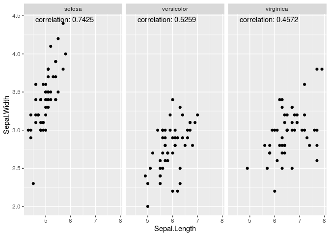

<!-- README.md is generated from README.Rmd. Please edit that file -->

# corrplot

<!-- badges: start -->

<!-- badges: end -->

The purpose of `corrplot` is to provide a easy way for exploring the
relationship between two variables. It will plot a scatter plot and show
the correlation coefficients.

## Installation

You can install the released version of `corrplot` from
[github](https://github.com/wu-2018/corrplot) with:

``` r
install.packages("devtools")
devtools::install_github("wu-2018/corrplot")
```

## Example

``` r
library(corrplot)
```

Use the iris dataset for
example:

``` r
correlation_scatter(datasets::iris, x='Sepal.Length', y='Sepal.Width', group='Species', cor_method = "pearson")
#> function started!
#> Successfully calculated the correlation!
```



It creates a scatter plot showing the relationship between
`Sepal.Length` and `Sepal.Length`, grouped by the factor `Species`. Note
the correlation coefficients are annotated.

## Implementation  
How I made each part of this R package:  
- Using `use_r()` to create the R scripts contains main functions.  
- Using `use_mit_license()` to add the license.  
- Using `document()` to generate the documentation files in `man`.  
- Using `use_testthat()` and `use_test()` for unit testing.  
- Using `use_package()` to modify the `DESCRIPTION` file, which specifies the dependencies.  
- Using `use_readme_rmd()` and `build_readme()` to generate the `README.md`.  
- Using `use_vignette()` to generate the vignettes.
